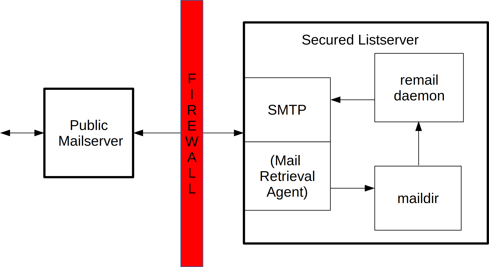

.. SPDX-License-Identifier: GPL-2.0

.. _remail_introduction:

Introduction
============

remail is a very simplistic mailing list tool which provides encryption.

Why yet another mailing list tool?
----------------------------------

The handling of the embargoed hardware security issues made it necessary
to have a encrypted mailing list. Managing Cc lists manually and dealing
with the odd GPG integrations in the mail clients is just not a workable
solution.

There are only a few Open Source implementations of encrypted mailing lists
available. Some of them are abandoned projects. The alive ones have their
own set of shortcomings. One of them supports only S/MIME. The other
supports only PGP, but did not survive testing in a real world
deployment. Repairing ruby code and dis-tangling the thing from its weird
daemons and other over-engineered features was certainly not a project for
the weekend.

After thinking about it for a while, I recognized that for the purpose at
hand the tool can be very simplistic. Using existing tools like getmail and
SMTP servers plus the knowledge about the gory details of emails which I
gained by writing mail handling scripts in python for my daily work, made
it possible to implement it in a rather short time.

What it does
------------

remail reads mail from a maildir, decrypts it with the mailing list private
key and re-encrypts it for every enabled subscriber. The resulting mails are
delivered to the localhost's SMTP server.

remail supports S/MIME and PGP on both ends.

No MUA functionality and no complicated SMTP delivery mechanisms are
required. They all exist in well maintained tools already.

The list configuration is a simple yaml file and is maintained manually
with your favorite text editor. Building tools around that is not part of
this project and there are many existing ways to handle that conveniently.

The proven in use mechanism is to have the configuration files in git and
let the mailing list system either check for updates regularly or get some
external notification that a new configuration is available.

What it does not
----------------

It does not care about mail transport on the receiving side, no POP or IMAP
support as this can be handled by tools like getmail.

It does not care about complex mail transport on the sending side as this
can be handled by SMTP servers like postfix or exim.

It has no integration into SMTP server transports or filters because it
makes no sense to deploy such a sensitive mechanism on a public facing
machine.

It does not come with GUI and managenent tools. A crypto mailing list is
subscribers only for obvious reasons and not meant to handle a large amount
of subscribers. It's meant for secure communications of a small group of
people without having the hassle of keeping Cc lists up to date and
encrypting for every recipient.

How it works
------------

The mailing list has the usual post, bounce and owner email addresses on a
public mail server. These addresses are aliased to a user account. The
mails are stored in the users inbox or forwarded to a protected machine.

The mailing list software runs on a protected and separated machine behind
firewalls and access barriers like any other sensitive application.

The mail is retrieved from the public facing machine by any of the existing
mechanisms, e.g. getmail, fetchmail or any MTA which can deliver mail to a
maildir. remail does not implement any transport on the incoming side as
there are good tools available which can handle the requirements of a
particular setup.

The list daemon retrieves the mails from the maildir and selects the
appropriate list via the 'To' header. It then decrypts the incoming mail,
re-encrypts it for each subscriber and delivers it to the local SMTP server
which takes care of relaying it to the public facing SMTP server.
